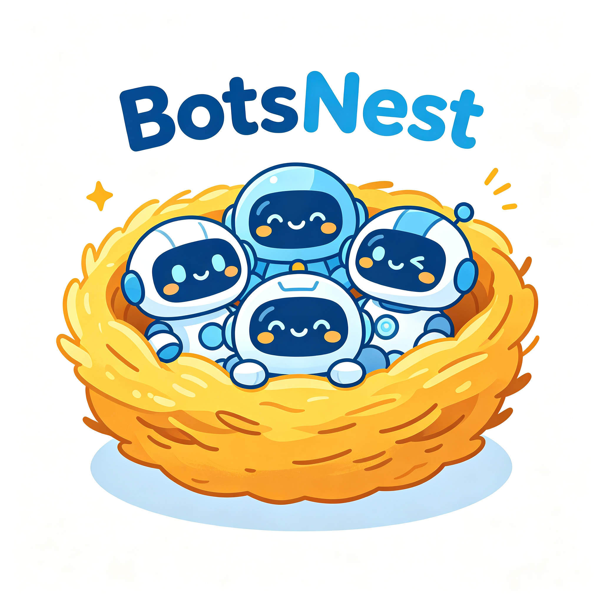
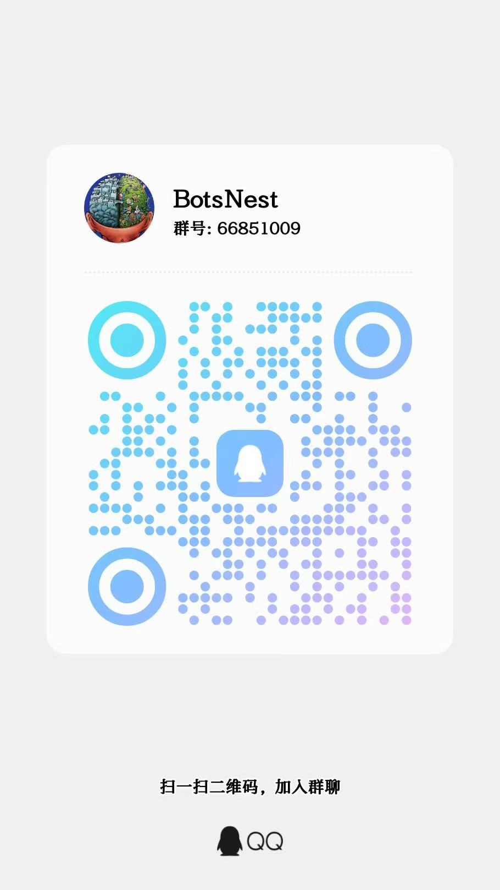

<p align="center">
  
</p>

<h1 align="center">Bots Nest</h1>

<p align="center">
  <strong>多平台 LLM 机器人平台</strong> —— 自托管、多机器人、可扩展的 AI 对话引擎
</p>

<p align="center">
  
  
  
  
  <a href="./COMMERCIAL_LICENSE.md"></a>
</p>

---

## 目录

- [项目介绍](#项目介绍)
- [商业授权](#商业授权)
- [核心功能](#核心功能)
- [技术栈](#技术栈)
- [快速开始](#快速开始)
- [配置说明](#配置说明)
- [后续计划](#后续计划)
- [联系我们](#联系我们)
- [License](#license)

---

## 项目介绍

**Bots Nest** 是一个自托管的**多平台 LLM 机器人平台**，支持同时运行多个机器人实例（目前支持企业微信和钉钉）。每个机器人可绑定不同的 LLM Provider 和模型，配备独立的技能引擎和会话管理，通过管理后台统一配置和监控。

团队成员可以直接在 IM 聊天中与 AI 对话、执行 Shell 命令、调用自定义工具，无需离开聊天应用。

### 核心能力

| 能力 | 说明 |
|------|------|
| 多机器人 | 同时运行多个企业微信机器人，独立配置、独立运行 |
| 多 LLM Provider | 兼容 OpenAI API 格式，支持任意 LLM 提供商 |
| 技能引擎 | 每个机器人可配置多个技能，匹配触发注入 system prompt + tools |
| MCP 集成 | 支持 MCP JSON-RPC（Streamable HTTP）与本地命令 MCP 服务，扩展 AI 能力 |
| Shell Agent | LLM 自动执行 Shell 命令，支持流式输出、白名单和超时安全控制 |
| 代码执行沙箱 | 集成 go-judge，在隔离环境中安全执行多语言代码（Python/Node/Go/C++/Java），可关联技能 Tool |
| RAG 知识库 | 集成 Weaviate 向量数据库 + 本地 Embedding 模型，支持文档导入、切片、向量检索与知识增强问答 |
| 会话管理 | SQLite 本地存储，支持历史查看、过期、压缩和删除 |
| 管理后台 | React 19 + Ant Design 构建的全功能 Web 管理界面 |

---

## 双授权模式

Bots Nest 采用 **AGPL v3 + 商业授权** 的双授权模式：

| 版本 | 许可证 | 费用 | 适用场景 |
|------|--------|------|----------|
| **开源版（社区版）** | [AGPL v3](./LICENSE) | 免费 | 个人学习、非商业使用、愿意开源修改的企业 |
| **商业版** | [商业授权](./COMMERCIAL_LICENSE.md) | 付费 | 企业内部私有化部署、不愿公开修改代码 |

**简单来说：**
- 如果你能接受修改代码后开源 → 用 AGPL 免费版
- 如果你需要保留代码私有 → 购买商业授权
- 商业授权包含优先技术支持和授权保障

👉 [查看商业授权详情](./COMMERCIAL_LICENSE.md)

---

## 核心功能

### 多机器人管理

- 支持同时运行**多个**机器人（企业微信 / 钉钉）
- 每个机器人独立配置平台类型和凭证
- 动态启停单个机器人，不影响其他实例
- 自动重连：断线后自动恢复连接

### LLM Provider 公共配置

- 兼容 OpenAI API 格式的 LLM 提供商（OpenAI、Azure、Claude、DeepSeek、智谱、千问等）
- 公共配置，所有机器人共享
- 创建时自动探测可用模型列表
- 支持页面 CRUD 管理

### MCP 工具服务

- [Model Context Protocol](https://modelcontextprotocol.io) 标准集成，支持 **JSON-RPC 2.0 / Streamable HTTP** 协议
- 支持远程 MCP 服务（自动发现 `tools/list`）与**本地命令 MCP 服务器**（以子进程长连接模式启动，支持环境变量注入）
- 全局公共配置，所有机器人可用
- 工具名自动前缀隔离（`{mcpID}__{toolName}`）

### Skill 技能引擎

- 每个机器人独立配置技能组
- 技能通过关键词匹配自动触发
- 自定义 system prompt 和工具定义
- 热加载：修改技能即时生效
- 技能可关联 **代码执行 Tool**，由 AI 按需调用沙箱执行逻辑

### Shell Agent

- LLM 驱动的 Shell 命令执行，支持**流式输出**
- 命令白名单控制
- 交互式命令（vim、top 等）自动拦截
- 超时控制 + 输出长度截断

### 代码执行沙箱（go-judge）

- 集成 [go-judge](https://github.com/criyle/go-judge) 隔离沙箱
- 支持 Python3 / Node.js / Go / C / C++ / Java 等多语言执行
- 二进制编译产物缓存，分步编译运行，支持 CLI 参数与 stdin
- 沙箱默认以特权容器运行，执行环境隔离，适合运行用户代码
- 可作为技能 Tool，由 LLM 自主调用

### RAG 知识库

- 集成 [Weaviate](https://weaviate.io) 向量数据库，支持混合检索（向量 + 关键词，`hybrid_alpha` 可调）
- 内置**本地 Embedding 模型**（基于 go-llama.cpp / GGUF，无需外部 API），首次使用自动下载
- 支持导入 `.md / .pdf / .docx / .txt / .csv` 文档，自动切片（chunk_size / chunk_overlap 可配）
- 导入时自动生成摘要，增强检索召回与上下文质量
- 按知识库隔离存储，AI 对话时自动检索相关片段进行知识增强

### 会话管理

- 按机器人隔离存储会话
- 私聊和群聊上下文分离
- 支持会话过期（软标记）和硬删除
- 自动摘要压缩（Token 超限时自动触发）

---

## 技术栈

| 层级 | 技术 | 说明 |
|------|------|------|
| **后端** | Go + Gin + GORM | HTTP 框架 + ORM |
| **数据库** | SQLite（WAL 模式） | 单文件数据库，零运维 |
| **向量数据库** | Weaviate | RAG 知识库向量检索与混合检索 |
| **Embedding** | go-llama.cpp（GGUF 本地模型） | 本地化向量化，无需外部 API |
| **代码沙箱** | go-judge | 隔离多语言代码执行 |
| **LLM 接入** | OpenAI 兼容 API | 支持任意兼容 Provider |
| **企业微信接入** | WebSocket 长连接 | 无需公网 IP，JSON 明文通信 |
| **钉钉接入** | Stream 模式（WebSocket） | 钉钉 Stream 模式，SessionWebhook 回复 |
| **前端** | React 19 + TypeScript + Ant Design | 管理后台 UI |
| **构建** | Vite + Makefile + Docker Compose | 单二进制部署，多阶段构建 |

---

## 快速开始

### 前置要求

- Go 1.26+
- Node.js 20+

### 1. 克隆项目

```bash
git clone https://github.com/hchw/bots-nest.git
cd bots-nest
```

### 2. 配置

复制 `config.yaml` 填入你的配置：

```yaml
# 数据库配置
database:
  driver: "sqlite"
  dsn: ".db/bots-nest.db?_journal_mode=WAL"

# LLM Providers（公共配置）
llm_providers:
  - name: "default"
    endpoint: "https://api.openai.com/v1"
    api_key: "sk-your-key-here"

# MCP 服务（公共配置）
mcps:
  - name: "example-mcp"
    endpoint: "http://localhost:9090"

# 机器人配置
bots:
  - name: "my-bot"
    platform: "wecom"
    platform_config:
      bot_id: "your-wecom-bot-id"
      secret: "your-wecom-secret"
    llm_provider_id: "default"
    llm_model: "gpt-4o"
    llm_temperature: 0.7
    llm_max_tokens: 2048
    max_session_tokens: 4096
    skills:
      - name: "search"
        description: "搜索技能"
        system_prompt: "你是一个搜索助手"
        tools: "[]"
```

### 3. 运行

```bash
# 安装前端依赖
cd web/ui && npm install && cd ../..

# 开发模式（自动启动 go-judge 沙箱、Weaviate 与前后端）
make dev

# 构建生产版本
make build
./bots-nest
```

> 注：代码沙箱（go-judge）与向量数据库（Weaviate）为独立服务。生产部署推荐使用 Docker Compose，详见下文。

### 4. Docker 部署

```bash
# 构建并启动全部服务（app / go-judge 沙箱 / Weaviate）
make docker-build
docker compose up -d
```

访问 `http://localhost:8080` 进入管理后台。各服务默认端口：

- `8080` — Bots Nest 主服务
- `5050` — go-judge 代码沙箱
- `8079` — Weaviate 向量数据库

---

## 配置说明

Bots Nest 采用 **YAML 启动加载 + API 运行时持久化**的配置策略：

1. 首次启动时从 `config.yaml` 读取数据写入 SQLite
2. 运行时所有配置变更通过管理后台 API 直接读写数据库
3. 页面 CRUD 操作即时生效，无需重启服务

### 企业微信接入

本项目使用企业微信**智能机器人长连接模式**（WebSocket API）：

- 无需公网 IP
- 无需消息加解密（JSON 明文传输）
- 仅需 **Bot ID + Secret** 两个凭证
- 文档：[企业微信智能机器人](https://developer.work.weixin.qq.com/document/path/101463)

### 钉钉接入

本项目使用钉钉 **Stream 模式**（WebSocket 长连接）：

- 无需公网 IP
- 使用 `github.com/open-dingtalk/dingtalk-stream-sdk-go`
- 仅需 **Client ID（AppKey）+ Client Secret（AppSecret）** 两个凭证
- 回复通过 SessionWebhook HTTP POST 发送
- 文档：[钉钉 Stream 模式机器人](https://open.dingtalk.com/document/orgapp/stream-mode-robot)

### LLM 模型自动探测

创建或编辑 LLM Provider 时，系统自动调用 `GET /{endpoint}/models` 接口缓存可用模型列表。创建机器人时自动拉取作为下拉选项，也支持手动输入模型名。

### 代码沙箱（go-judge）

```yaml
go_judge_endpoint: "http://localhost:5050"   # go-judge 服务地址，供技能 Tool 与代码执行使用
```

### 向量数据库（Weaviate）

```yaml
weaviate:
  endpoint: "localhost:8079"   # Weaviate gRPC/REST 地址
  scheme: "http"
  api_key: ""                  # 如启用鉴权则填写
```

### 知识库（RAG）

```yaml
knowledge_base:
  max_file_size: 52428800                 # 单文件大小上限（字节）
  allowed_extensions: [".md", ".pdf", ".docx", ".txt", ".csv"]
  chunk_size: 500                         # 切片长度
  chunk_overlap: 50                       # 切片重叠
  search_default_top_k: 5                 # 默认召回数量
  search_hybrid_alpha: 0.5                # 混合检索权重（0=纯关键词，1=纯向量）
  embedding:
    enabled: true                         # 启用内置本地 Embedding 模型
    model_url: "https://huggingface.co/.../all-MiniLM-L6-v2-Q8_0.gguf"
    model_path: "data/embedding/models/all-MiniLM-L6-v2-Q8_0.gguf"
```

> 内置 Embedding 模型基于 [go-llama.cpp](https://github.com/go-skynet/go-llama.cpp)（需 CGO + llama.cpp 共享库）。首次使用会自动从 `model_url` 下载 GGUF 模型到 `model_path`。生产构建通过 `make build` 一并编译 llama.cpp；Docker 镜像已自带运行库。


## 后续计划

Bots Nest 将持续迭代，以下是我们规划中的核心功能：

### 账户与权限系统

- 用户注册/登录（JWT + Session 双模式）
- 多角色权限管理：管理员、操作员、只读用户
- API Key 管理与访问控制
- 操作审计日志

### 企业微信深度集成

- 支持企业微信 Webhook 回调模式（适合有公网 IP 的用户）
- 富媒体消息支持（图片、文件、语音、视频）
- 企业微信通讯录同步
- 应用消息主动推送

### 集群与高可用部署

- 多节点集群部署，支持水平扩展
- 分布式会话存储（PostgreSQL / MySQL）
- Redis 缓存 + 消息队列
- 负载均衡与健康检查
- 灾备与自动故障转移

### 定时任务与提醒

- 内置 Cron 调度器
- 定时消息推送（日报、周报、提醒）
- LLM 驱动的定时任务生成
- 日历与事件提醒集成

### 内置 LLM Provider 套餐购买

- 集成主流 LLM 厂商 API 代理
- 按量计费 / 包月套餐
- 用量统计与账单
- 额度预警与控制
- 一键开通，无需自行申请 API Key

### Skill 定制市场

- Skill 模板市场（社区贡献）
- 可视化 Skill 编辑器（拖拽式）
- Skill 版本管理与回滚
- 按机器人/按用户/按群组分配技能
- 技能运行日志与监控

### MCP 生态扩展

- MCP 注册中心与发现机制
- 内置常用 MCP 服务（数据库查询、数据分析等）
- MCP 健康监控与熔断
- 自定义 MCP 快速开发 SDK

### 更多消息渠道

- ✅ 钉钉机器人
- 飞书机器人
- Discord Bot
- Telegram Bot
- Slack App
- 多渠道消息统一接入

### LLM 增强特性

- 多模态模型接入（图片理解、文件分析）
- 敏感词过滤与内容审核
- Prompt 模板管理

> ✅ 已完成：RAG 检索增强生成、知识库管理、本地 Embedding 模型、go-judge 代码沙箱、MCP JSON-RPC 与本地命令服务、流式 Shell 执行、多平台架构抽象、钉钉机器人接入。

---

## 联系我们

<p align="center">
  
</p>

<p align="center">
  扫码加入 QQ 群，获取更多信息与技术支持<br>
  或添加微信：<strong>hbl826396273</strong><br>
  或发送邮件：<strong>2012hchw@gmail.com</strong>
</p>

---

## License

Bots Nest 采用双授权模型：

- **开源版** — [GNU Affero General Public License v3](./LICENSE)（AGPL v3）
  - 自由使用、修改、分发，但修改后的代码必须开源
  - 通过网络提供服务时，必须提供完整的源代码
- **商业版** — [商业授权](./COMMERCIAL_LICENSE.md)
  - 允许企业内部私有化部署和二次开发
  - 无需公开任何修改代码
  - 包含优先技术支持

详见 [LICENSE](./LICENSE) 和 [COMMERCIAL_LICENSE.md](./COMMERCIAL_LICENSE.md)。
